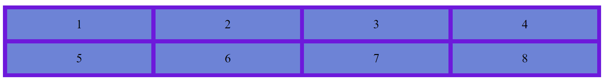
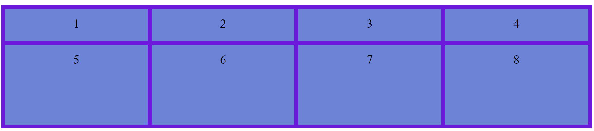

# Quick Guide to CSS Grid

.png)

In this article we are going to understand what is Grid property in CSS and how it help us to design a beautiful web page. In earlier topic (Flex) we have seen that using flex we can work on either row or columns at a time, but Grids can work on both. GRID gives us more flexibility to move around the blocks irrespective of HTML markup.

> CSS GRID helps us to create the outer layout of the webpage. CSS grids are for 2D layouts. It works with both rows and columns.

<br/>

## Table of Content
1. display
2. grid-column-start / grid-column-end <br/>
    grid-row-start / grid-row-end
3. grid-template-start / grid-template-end
4. justify-items
5. align-items
6. justify-content

****
<br/>

**display** - To make an HTML element behave as a grid container, we have to set the display property to grid. Grid containers consist of grid items, placed inside columns and rows

```
CSS

.container {
display: grid
}
```


****
<br/>

**grid-column-start / grid-column-end <br/> grid-row-start / grid-column-end**
<br/>

_grid-column-start_ is the line where the item begins, and grid-column-end is the line where the item ends. It can have following values:
- ```<line>``` - It can be number to refer to a numbered grid line, or a name to refer to a named grid line
- auto - It indicates auto-placement, an automatic span, or a default span of one.


****
<br/>

**grid-template-columns / grid-template-rows**
<br/>

_grid-template-column_ property defines the number of columns in your grid layout, and with this we can define the width of each column. The values are space-separated list.

```
CSS

.grid-container {
  display: grid;
  grid-template-columns: auto auto auto auto;
}
```



<br/>

_grid-template-rows_ property defines the height of each row. The values are space-separated list.

```
CSS

.grid-container {
  display: grid;
  grid-template-rows: 80px 100px;
}
```



****
<br/>

**justify-items** - _justify-items_ property aligns grid items along the x-axis (row), giving them all a default way of justifying each box along the appropriate axis

```
CSS

.container {
  justify-items: start | end | center | stretch;
}
```

- **_start_** - The items are align towards the start of the container in the x-axis (row)

<br/>

- **_end_** - The items are align towards the end of the container in the x-axis (row)

<br/>

- **_center_** - The items are align in center of the container

<br/>

- **_stretch_** - If the combined size of the items are smaller than the container, then the combined sized items exactly fills the container

<br/>


****
<br/>

**align-items** - _align-items_ property aligns grid items along the y-axis (column), This values applies to all grid items inside the container

```
CSS

.container {
  align-items: start | end | center | stretch;
}
```

- **_start_** - The items are align towards the start of the container in the y-axis (column)

<br/>

- **_end_** - The items are align towards the end of the container in the y-axis (column)

<br/>

- **_center_** - The items are align in center of their cell

<br/>

- **_Stretch_** :- The items fills the whole height of the cell

<br/>


****
<br/>

**justify-content** - When the total size of the grid is less than the size of its grid container. Then you can set the alignment of grid, this property aligns the grid along the x-axis (Inline)

```
CSS

.container {
  justify-content: start | end | center | stretch | space-around | space-between | space-evenly;    
}
```

- **_start_** - Align the grid to the start of the container

<br/>

- **_end_** - Align the grid to the end of the container

<br/>

- **_center_** - Align the grid to the center of the container

<br/>

- **_stretch_** - Resize the grid and fill the full width of the container

<br/>

- **_space-around_** - places an even amount of space between each grid item, with half-sized spaces on the far ends

<br/>

- **_space-between_** - places an even amount of space between each grid item, with no space at the far ends

<br/>

- **_space-evenly_** - places an even amount of space between each grid item, including the far ends

<br/>

