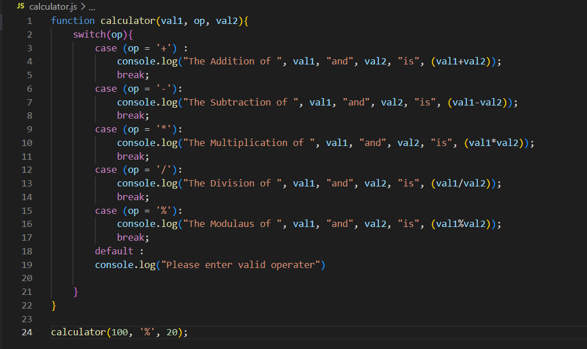

# Calculator

- Basic calculator terminal based application using Functions and switch case in JavaScript.
- Which can perform
    1. Addition
    2. Subtraction
    3. Multiplication
    4. Division
    5. Modulaus

Code

Addition

Subtraction

Multiplication

Division

Modulaus
