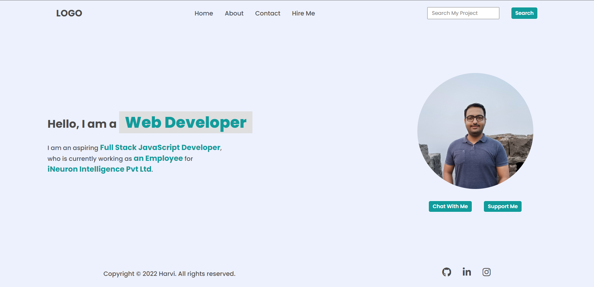

# Final Result of Project 01 of DOM


### **Task 1** 
#### Output


#### Code
```
JavaScript

const hire_me_item = document.createElement("li");
const textnode = document.createTextNode("Hire Me");
hire_me_item.appendChild(textnode);
document.querySelector("ul").appendChild(hire_me_item);
```

### **Task 2**
#### Output


#### Code
```
JavaScript

document.querySelector("input").placeholder = "Search My Project";
```

### **Task 3**
#### Output


#### Code
```
JavaScript

document.querySelectorAll("span")[2].innerText = "an Employee";
document.querySelectorAll("span")[3].innerText = "iNeuron Intelligence Pvt Ltd"
```

### **Task 4**
#### Output


#### Code
```
JavaScript

document.querySelector("img").src = "avtar2.jpg";
```

### **Task 5**
#### Output


#### Code
```
JavaScript

const support_me_button = document.createElement("button");
const textnode1 = document.createTextNode("Support Me");
support_me_button.appendChild(textnode1);
document.querySelector(".hero-right-section-btns").appendChild(support_me_button);
```