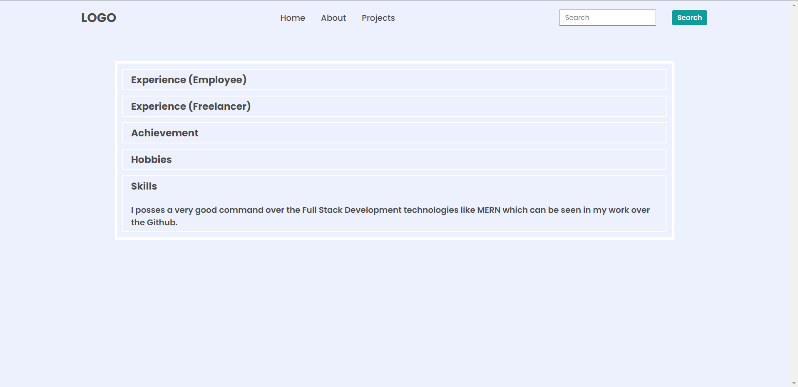
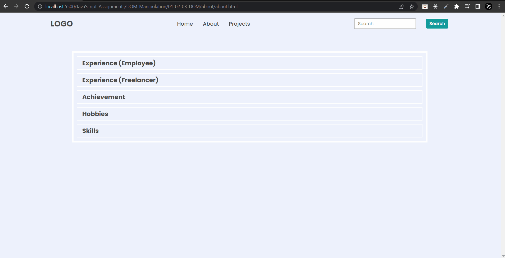

# Final Result of Project 02 of DOM


### **Task 1** 
#### Output


#### Code
```
JavaScript

document.querySelectorAll("a")[2].innerText = "Projects";
```

### **Task 2**
#### Output


#### Code
```
JavaScript

// create div 
const new_div = document.createElement("div");
new_div.classList.add("accordian");
document.querySelector(".accordian-wrapper").appendChild(new_div);

// create h3
const skills_title = document.createElement("h3");
const textnode1 = document.createTextNode("Skills");
skills_title.appendChild(textnode1);
document.querySelectorAll(".accordian")[4].appendChild(skills_title);

// create p
const skills_para = document.createElement("p");
const textnode2 = document.createTextNode("I posses a very good command over the Full Stack Development technologies like MERN which can be seen in my work over the Github.")
skills_para.appendChild(textnode2);
document.querySelectorAll(".accordian")[4].appendChild(skills_para);
```