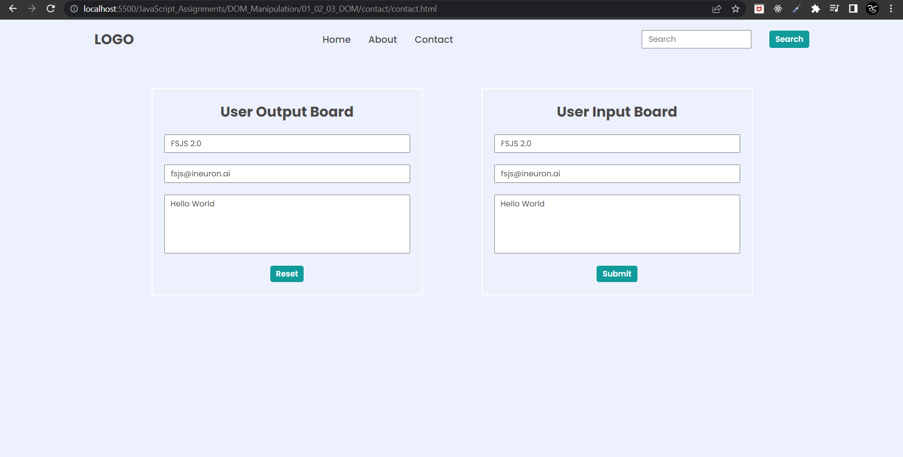

# Final Result of Project 03 of DOM


### **Task 1** 
#### Output


#### Code
```
JavaScript

// User output board
// Name
const name1 = document.querySelector(".enterName").value = "FSJS 2.0";

// Mail
const mail1 = document.querySelector(".enterMail").value = "fsjs@ineuron.ai";

// Message
const msg1 = document.querySelector(".enterMessage").value = "Hello World";

// User iutput board
// Name
const name2 = document.querySelector(".userName").value = "FSJS 2.0";

// Mail
const mail2 = document.querySelector(".userEmail").value = "fsjs@ineuron.ai";

// Message
const msg2 = document.querySelector(".userMessage").value = "Hello World";
```