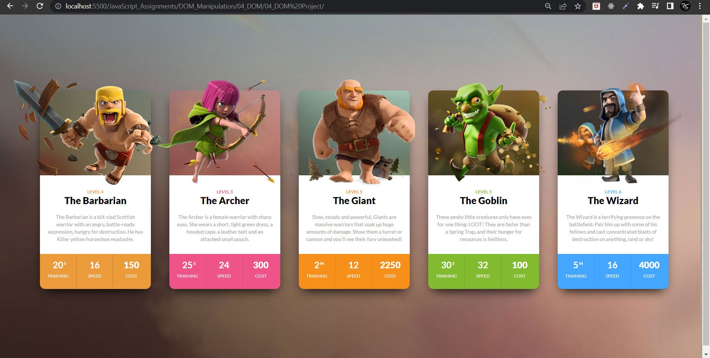

# Final Result of Project 04 of DOM

 
#### Code
```
JavaScript

// first card
// background-color
document.querySelector(".clash-card__unit-stats.clash-card__unit-stats--barbarian.clearfix").style.background = "#ec9b3b";

// font color
document.querySelectorAll(".stat")[0].style.color = "#ffffff";
document.querySelectorAll(".stat")[1].style.color = "#ffffff";
document.querySelectorAll(".stat")[2].style.color = "#ffffff";
document.querySelectorAll(".stat-value")[0].style.color = "#ffffff";
document.querySelectorAll(".stat-value")[1].style.color = "#ffffff";
document.querySelectorAll(".stat-value")[2].style.color = "#ffffff";


// second card
// Update Character Name
document.querySelector(".clash-card__level.clash-card__level--archer").nextElementSibling.innerText = "The Archer";

// background-color
document.querySelector(".clash-card__unit-stats.clash-card__unit-stats--archer.clearfix").style.background = "#ee5487";

// font color
document.querySelectorAll(".stat")[3].style.color = "#ffffff";
document.querySelectorAll(".stat")[4].style.color = "#ffffff";
document.querySelectorAll(".stat")[5].style.color = "#ffffff";
document.querySelectorAll(".stat-value")[3].style.color = "#ffffff";
document.querySelectorAll(".stat-value")[4].style.color = "#ffffff";
document.querySelectorAll(".stat-value")[5].style.color = "#ffffff";


// third card
// background-color
document.querySelector(".clash-card__unit-stats.clash-card__unit-stats--giant.clearfix").style.background = "#f6901a";

// font color
document.querySelectorAll(".stat")[6].style.color = "#ffffff";
document.querySelectorAll(".stat")[7].style.color = "#ffffff";
document.querySelectorAll(".stat")[8].style.color = "#ffffff";
document.querySelectorAll(".stat-value")[6].style.color = "#ffffff";
document.querySelectorAll(".stat-value")[7].style.color = "#ffffff";
document.querySelectorAll(".stat-value")[8].style.color = "#ffffff";


// fourth card
// Update character name
document.querySelector(".clash-card__level.clash-card__level--goblin").nextElementSibling.innerText = "The Goblin";

// background-color
document.querySelector(".clash-card__unit-stats.clash-card__unit-stats--goblin.clearfix").style.background = "#82bb30";

// font color
document.querySelectorAll(".stat")[9].style.color = "#ffffff";
document.querySelectorAll(".stat")[10].style.color = "#ffffff";
document.querySelectorAll(".stat")[11].style.color = "#ffffff";
document.querySelectorAll(".stat-value")[9].style.color = "#ffffff";
document.querySelectorAll(".stat-value")[10].style.color = "#ffffff";
document.querySelectorAll(".stat-value")[11].style.color = "#ffffff";


// fifth card
// background-color
document.querySelectorAll(".clash-card__unit-stats.clash-card__unit-stats--wizard.clearfix")[0].style.background = "#44a6ff";

// font color
document.querySelectorAll(".stat")[12].style.color = "#ffffff";
document.querySelectorAll(".stat")[13].style.color = "#ffffff";
document.querySelectorAll(".stat")[14].style.color = "#ffffff";
document.querySelectorAll(".stat-value")[12].style.color = "#ffffff";
document.querySelectorAll(".stat-value")[13].style.color = "#ffffff";
document.querySelectorAll(".stat-value")[14].style.color = "#ffffff";
```