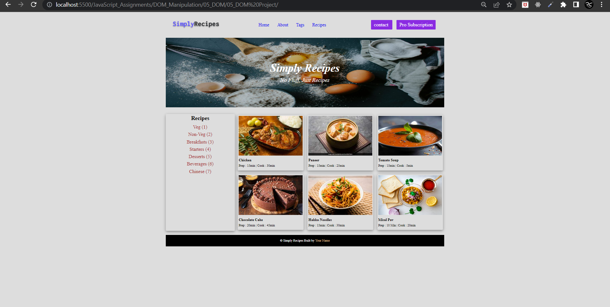

# Final Result of Project 04 of DOM

 
#### Code
```
JavaScript

// Pro Subscription button
    const subscription_button = document.createElement("a");
    subscription_button.classList.add("btn");
    subscription_button.setAttribute("href", "");
    const textnode = document.createTextNode("Pro Subscription");
    subscription_button.appendChild(textnode);
    document.querySelector(".nav-links").nextElementSibling.appendChild(subscription_button);

    // Chinese (7) item
    const chinese_item = document.createElement("a");
    chinese_item.setAttribute("href", "");
    const textnode2 = document.createTextNode("Chinese (7)");
    chinese_item.appendChild(textnode2);
    document.querySelector(".text-r").nextElementSibling.appendChild(chinese_item);

    // create new recipes card
    // create div with card class
    const card_div = document.createElement("div");
    card_div.classList.add("card");
    document.querySelector(".recipe-gallery").appendChild(card_div);

    // create a with recipe-text class
    const recipe_a = document.createElement("a");
    recipe_a.classList.add("recipe-text");
    document.querySelectorAll(".card")[5].appendChild(recipe_a);

    // create img with recipe-img class
    const recipe_img = document.createElement("img");
    recipe_img.classList.add("recipe-img");
    recipe_img.setAttribute("src", "./img/recipe-6.jpg");
    document.querySelectorAll(".recipe-text")[5].appendChild(recipe_img);

    // create h5 with recipe-name class and Misal Pav as value
    const recipe_name_h5 = document.createElement("h5");
    recipe_name_h5.classList.add("recipe-name");
    const textnode3 = document.createTextNode("Misal Pav");
    recipe_name_h5.appendChild(textnode3);
    document.querySelectorAll(".recipe-text")[5].appendChild(recipe_name_h5);

    // create p with recipe-disp class with 10 min | Cook : 20min
    const recipe_disp_p = document.createElement("p");
    recipe_disp_p.classList.add("recipe-disp");
    const textnode4 = document.createTextNode("Prep : 10 min | Cook : 20min")
    recipe_disp_p.appendChild(textnode4);
    document.querySelectorAll(".recipe-text")[5].appendChild(recipe_disp_p);
```