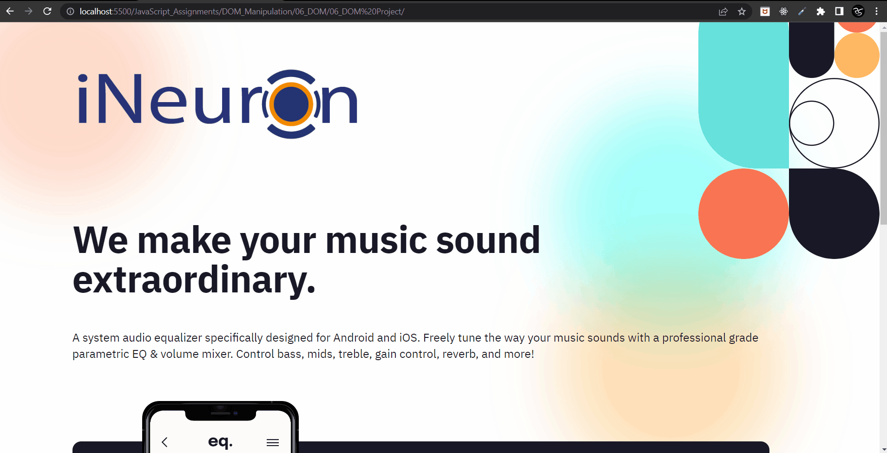
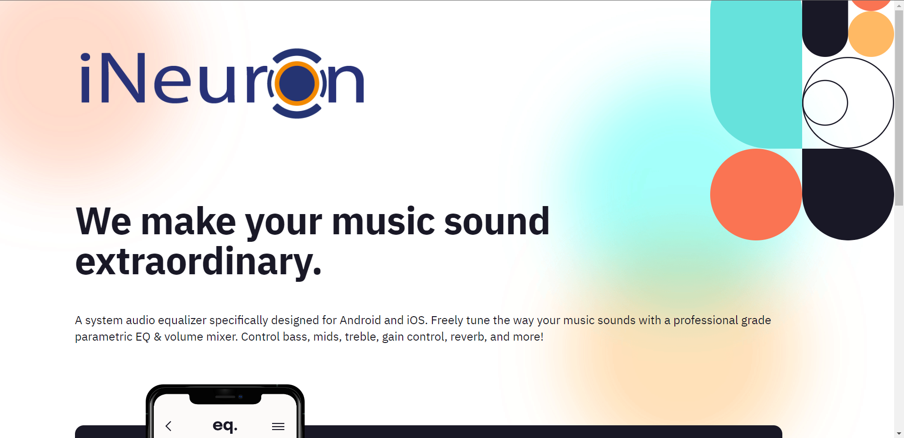
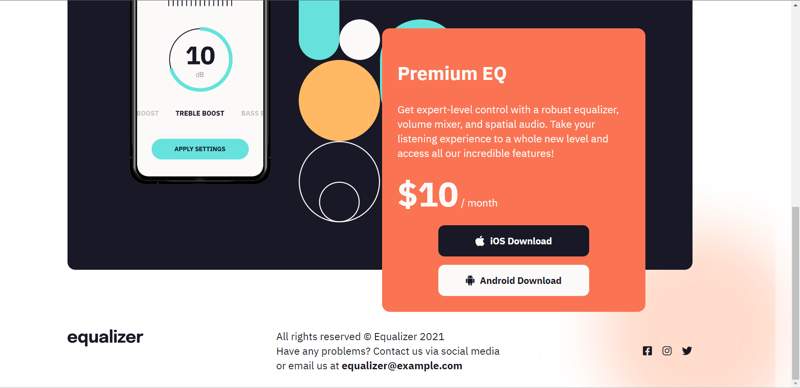

# Final Result of Project 04 of DOM

 

### **Task 1**
#### Output


#### Code
```
JavaScript

// Update logo
document.querySelector(".logo").src = "./assets/ineuron-logo.png";
document.querySelector(".logo").style.width = "500px";

// Update size of heading and paragraph
document.querySelector(".hero").children[0].style.fontSize = "65px";
```

### **Task 2**
#### Output


#### Code
```
JavaScript

// Update value
document.querySelector(".app_price").children[0].innerText = "$10";
```