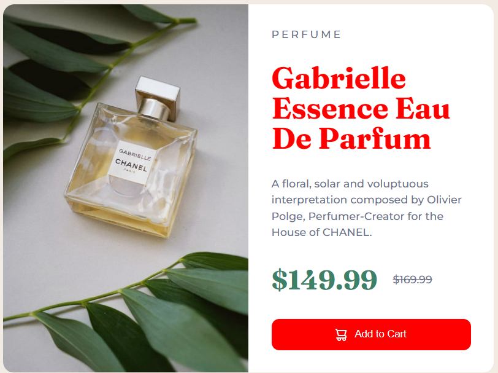
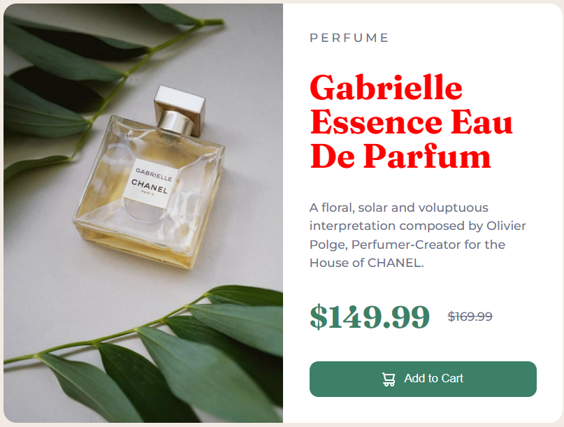

# Final Result of Project 04 of DOM

 

### **Task 1**
#### Output


#### Code
```
JavaScript

// Change the color of title
document.querySelector("h1").style.color = "red";
```

### **Task 2**
#### Output


#### Code
```
JavaScript

// change the color of add to cart button
document.querySelector("button").style.backgroundColor = "red";
```